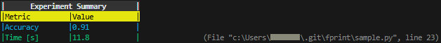

# fprint

`fprint` is a highly customizable replacement for Python’s built-in `print()` function.

It supports:

- Foreground and background colors (named colors and HEX codes)
- Fixed-width, table-style formatting
- Horizontal centering
- Proper handling of full-width characters (e.g., Japanese)
- Bold text
- File and line number display
- Indentation control

It is ideal for scripts, CLI tools, and logs that require readable, structured, or visually enhanced output.

---

## Installation

You can install `fprint` directly from this GitHub repository:

```bash
pip install git+https://github.com/codria/fprint.git
```

---

## Sample Code

```python
from fprint import fprint

# Title
fprint(
    "Experiment Summary",
    row_width=31,   # 31 spaces + 2 separators = 33 characters
    centering=True,
    fc="white",
    bc="#333333",
    bold=True,
)

# Header
fprint(
    "Metric", "Value",
    row_width=15,   # 15 spaces * 2 columns + 3 separators = 33 characters
    fc="black",
    bc="yellow",
)

# Rows
fprint("Accuracy", "0.91", row_width=15, fc="cyan")
fprint("Time [s]", "11.8", row_width=15, fc="green", show_lineno=True)
```
You can also run the same example directly via `sample.py` to see the output immediately.

### Sample Output


---

## Arguments

| Name         | Type     | Description                                            |
|--------------|----------|--------------------------------------------------------|
| `*args`     | str(s)   | Strings to print                                       |
| `indent`     | int      | Indentation level (2 spaces per level)                 |
| `fc`         | str      | Foreground color (name or HEX)                         |
| `bc`         | str      | Background color (name or HEX)                         |
| `bold`       | bool     | Whether to print in bold                               |
| `sep`        | str      | Separator between args                                 |
| `end`        | str      | Ending character (default: `\n`)                       |
| `row_width`  | int/str  | Column width or `"auto"`                               |
| `centering`  | bool     | Center-align text                                      |
| `show_lineno`| bool     | Show file and line number                              |


---

## Available Named Colors

```
black, white, red, green, blue, cyan, magenta, yellow
```
